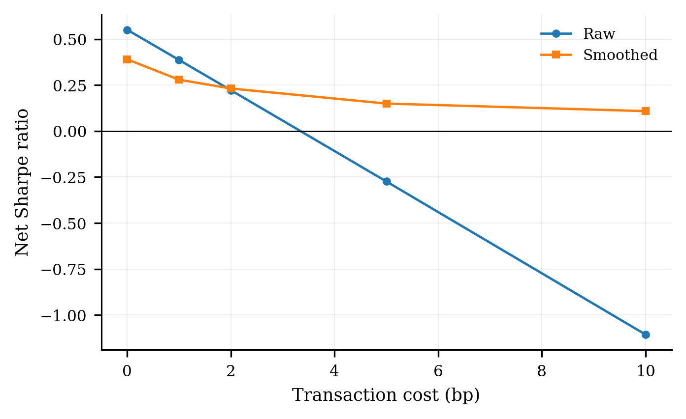

# RAM-FinGAN

Regime-aware extension of [Fin-GAN](https://github.com/milenavuletic/Fin-GAN) for stock--ETF excess-return forecasting.

This project keeps the original Fin-GAN stock--ETF forecasting setup and adds market-regime features built from ETFs, interest rates, volatility, and credit-spread proxies.

Reference paper: [Fin-GAN: Forecasting and Classifying Financial Time Series via Generative Adversarial Networks](https://doi.org/10.1080/14697688.2023.2299466)

## Forecasting Target

```text
p(y_{t+1} | C_t, R_t)
```

where:

- `C_t` is the historical stock--ETF return window;
- `R_t` is the market-regime state;
- `y_{t+1}` is the next-period stock--ETF excess return.

## 1. What Is Added

Compared with the original Fin-GAN setup, this repository adds:

- market-regime features from broad ETFs, sector ETFs, Treasury yields, VIX, and credit-spread proxies;
- regime-factor models for compressed market-state conditioning;
- transaction-cost, smoothing, ticker-level, period-level, and regime-level evaluation;
- cleaned result figures for GitHub display.

Implemented model variants:

- baseline LSTM;
- RAM-LSTM with direct raw market features;
- regime-factor LSTM;
- RAM-FinGAN v1;
- RAM-FinGAN v2 with supervised pretraining;
- RAM-FinGAN v3 with economic conditioning;
- regime-economic LSTM v4.

The current strongest model is the regime-factor LSTM. The GAN variants are retained as ablation studies.

## 2. Data

Raw market data are not included in this repository.

CRSP/WRDS data should be downloaded from [CRSP on WRDS](https://wrds-www.wharton.upenn.edu/pages/get-data/center-research-security-prices-crsp/).

Recommended WRDS path:

```text
CRSP -> Annual Update -> Legacy Data - Stock / Security Files -> Daily Stock File
```

Sample period:

```text
2000-01-01 to 2021-12-31
```

Expected local raw-data layout:

```text
data_raw/
├── crsp/
│   ├── Stocks-data.csv
│   ├── ETFs-data.csv
│   └── Market-ETFs-data.csv
└── external/
    ├── VIXCLS.csv
    ├── DGS10.csv
    ├── DGS2.csv
    ├── DGS3MO.csv
    └── BAMLH0A0HYM2.csv
```

External series:

- [VIXCLS](https://fred.stlouisfed.org/series/VIXCLS)
- [DGS10](https://fred.stlouisfed.org/series/DGS10)
- [DGS2](https://fred.stlouisfed.org/series/DGS2)
- [DGS3MO](https://fred.stlouisfed.org/series/DGS3MO)
- [BAMLH0A0HYM2](https://fred.stlouisfed.org/series/BAMLH0A0HYM2)

Note: historical access to `BAMLH0A0HYM2` through FRED may be limited depending on the data interface. In that case, use the ICE source directly or replace it with a documented credit-spread proxy such as `BAA10Y` or an `HYG-LQD` spread proxy.

## 3. Main Results

Cleaned result figures are stored in:

```text
results_figures/
```

### 3.1 Overall Model Comparison

The strongest zero-cost test performance is obtained by the regime-factor LSTM.

| Model | Direction Accuracy | Mean PnL (bp) | Test Sharpe | RMSE | MAE |
|---|---:|---:|---:|---:|---:|
| regime-factor LSTM | 51.62% | 2.88 | 0.551 | 0.01199 | 0.00697 |
| RAM-FinGAN v2 | 51.18% | 2.26 | 0.454 | 0.01208 | 0.00707 |
| RAM-FinGAN v3 | 51.26% | 1.80 | 0.374 | 0.01214 | 0.00715 |
| baseline LSTM | 51.19% | 1.57 | 0.303 | 0.01199 | 0.00697 |
| naive RAM-LSTM | 51.01% | 1.20 | 0.231 | 0.01205 | 0.00701 |

Key observation:

```text
Raw market features are not robust when directly concatenated with LSTM inputs.
Compressed regime-factor representations provide stronger out-of-sample performance.
```

### 3.2 COVID-Shock Performance

The regime-factor LSTM is especially strong during the COVID-shock period.

| Model | COVID-Shock Sharpe |
|---|---:|
| regime-factor LSTM | 0.797 |
| RAM-FinGAN v2 | 0.580 |
| baseline LSTM | 0.172 |
| naive RAM-LSTM | -0.126 |

This supports the main motivation of the project: market-regime information is most useful when the market environment changes sharply.

### 3.3 Transaction-Cost and Deployment Results

The raw regime-factor LSTM has strong predictive performance but high turnover. Transaction costs expose this weakness.

| Cost (bp) | Raw Sharpe | Smoothed Sharpe | Turnover Reduction |
|---:|---:|---:|---:|
| 0 | 0.551 | 0.390 | 66.3% |
| 1 | 0.387 | 0.279 | 77.4% |
| 2 | 0.222 | 0.231 | 94.8% |
| 5 | -0.274 | 0.149 | 97.5% |
| 10 | -1.106 | 0.108 | 99.8% |

Key observation:

```text
The regime-factor signal is useful, but practical deployment requires turnover-aware position smoothing or no-trade bands.
```

## 4. Core Figures

Only the most important figures are shown below.

### Overall Model Ranking


### Cumulative Test PnL


### Transaction-Cost Robustness


### Position Smoothing Under Costs



## 5. Usage

Install dependencies:

```bash
pip install -r requirements.txt
```

Run the pipeline after preparing the raw data:

```bash
python src/01_clean_and_check_raw_data.py
python src/02_fix_market_state_features.py
python src/05_make_lagged_market_features.py
python src/03_build_ram_panel.py
python src/04_check_ram_panel.py
python src/06_train_lstm_vs_ram_lstm.py
python src/07_train_regime_factor_lstm.py
python src/08_train_ram_fingan_v1.py
python src/09_train_ram_fingan_v2_pretrain.py
python src/10_train_ram_fingan_v3_econ.py
python src/11_train_regime_econ_lstm_v4.py
python src/12_analyze_all_models.py
python src/13_robustness_transaction_cost_bootstrap.py
python src/14_position_smoothing_cost_aware.py
python src/15_final_summary_tables.py
python src/16_make_publication_figures.py
```

Important note on ordering:

```text
05_make_lagged_market_features.py must be run before 03_build_ram_panel.py.
```

This avoids look-ahead bias by ensuring that market-state features are lagged before they are merged into the stock-level forecasting panel.

## 6. Repository Contents

Public repository contents:

```text
configs/
results_figures/
src/
README.md
requirements.txt
.gitignore
```

Excluded from the public repository:

```text
data_raw/
data_clean/tickers/
data_clean/ram_panel/
outputs/
```

These excluded folders may contain licensed CRSP data, intermediate files, trained models, logs, or large outputs.

## 7. Interpretation

The main empirical conclusion is not that GAN variants dominate.

Instead, the evidence supports a more nuanced claim:

1. Directly adding raw market-state variables is not robust.
2. Compressing market information into regime factors improves out-of-sample forecasting.
3. The regime-factor model is particularly useful during market-shock periods such as COVID.
4. GAN-style adversarial training is unstable in this small-signal financial forecasting setting.
5. Transaction costs expose a high-turnover weakness.
6. Turnover-aware position smoothing improves deployability under realistic costs.

Suggested research direction:

```text
Regime-factor representation and turnover-aware deployment
for robust stock--ETF excess-return forecasting under market regime shifts.
```

The GAN variants should be interpreted as ablation studies rather than as the final main model.

## 8. Disclaimer

This repository is for research use only. It is not financial advice.
