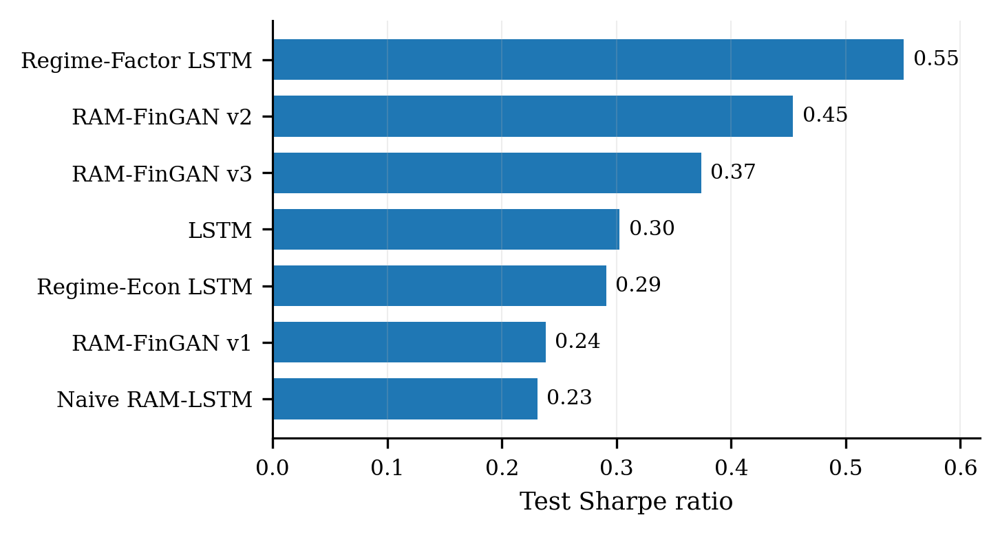
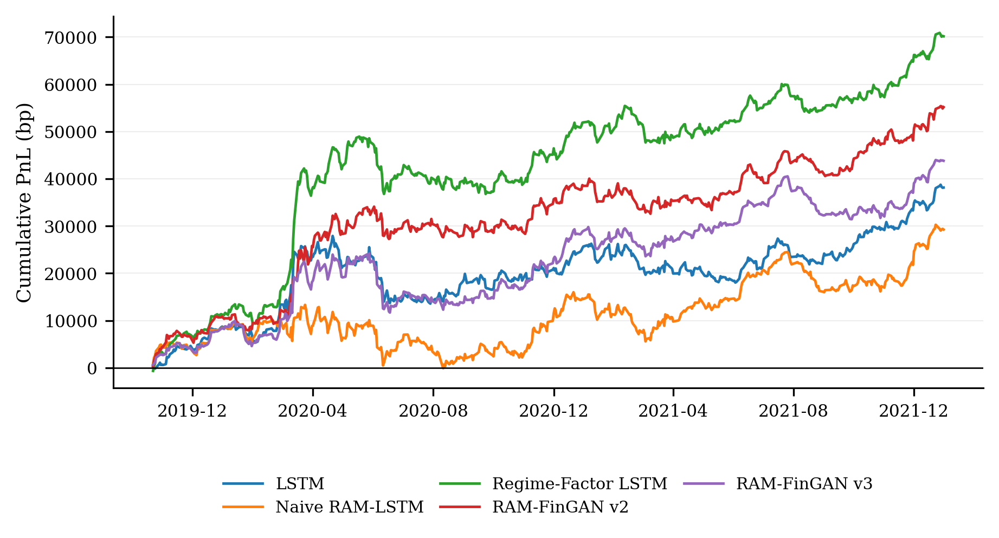
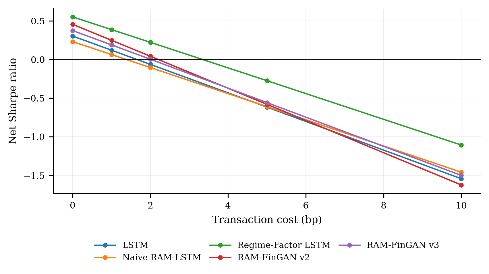
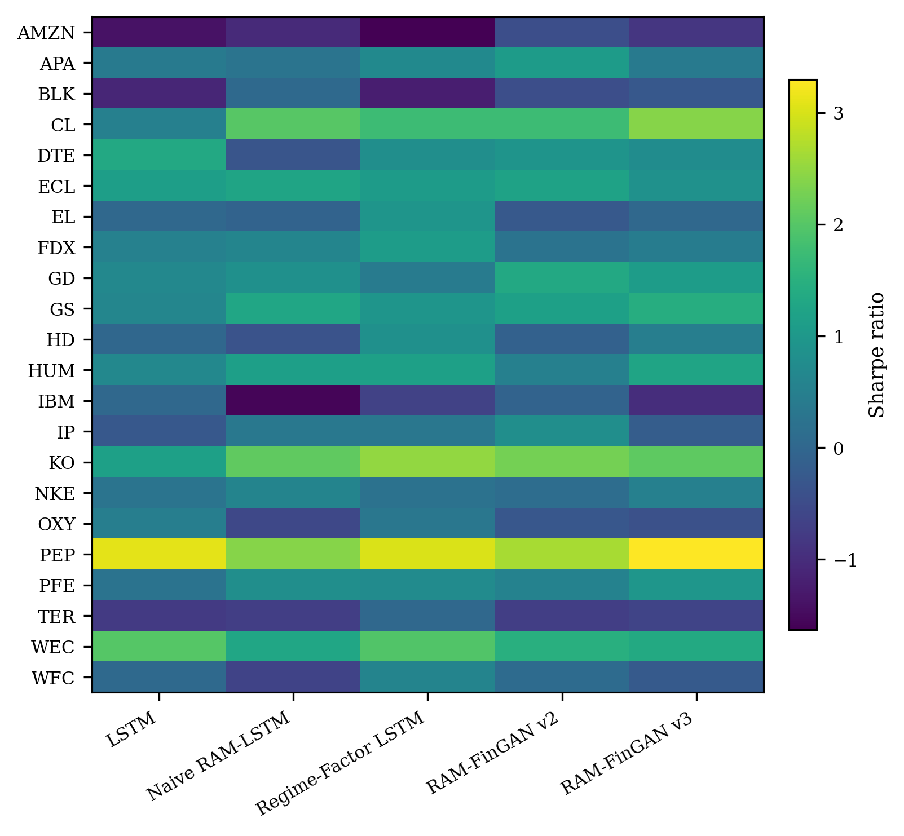

# RAM-FinGAN

Regime-aware extension of [Fin-GAN](https://github.com/milenavuletic/Fin-GAN) for stock--ETF excess-return forecasting.

This project keeps the original Fin-GAN stock--ETF forecasting setup and adds market-regime features built from ETFs, interest rates, volatility, and credit-spread proxies.

Reference paper: [Fin-GAN: Forecasting and Classifying Financial Time Series via Generative Adversarial Networks](https://doi.org/10.1080/14697688.2023.2299466)

Forecasting target:

```text
p(y_{t+1} | C_t, R_t)
```

where `C_t` is the historical stock--ETF return window, `R_t` is the market-regime state, and `y_{t+1}` is the next-period excess return.

## 1. What is added

Compared with the original Fin-GAN setup, this repository adds:

- market-regime features from broad ETFs, sector ETFs, Treasury yields, VIX, and credit-spread proxies;
- regime-factor models for compressed market-state conditioning;
- transaction-cost, smoothing, ticker-level, period-level, and regime-level evaluation;
- cleaned result figures for GitHub display.

Implemented model variants:

- baseline LSTM
- RAM-LSTM with direct market features
- regime-factor LSTM
- RAM-FinGAN v1
- RAM-FinGAN v2 with pretraining
- RAM-FinGAN v3 with economic conditioning
- regime-economic LSTM v4

## 2. Data

Raw market data are not included in this repository.

CRSP/WRDS data should be downloaded from [CRSP on WRDS](https://wrds-www.wharton.upenn.edu/pages/get-data/center-research-security-prices-crsp/).

Recommended WRDS path:

```text
CRSP -> Annual Update -> Legacy Data - Stock / Security Files -> Daily Stock File
```

Sample period:

```text
2000-01-01 to 2021-12-31
```

Expected local raw-data layout:

```text
data_raw/
├── crsp/
│   ├── Stocks-data.csv
│   ├── ETFs-data.csv
│   └── Market-ETFs-data.csv
└── external/
    ├── VIXCLS.csv
    ├── DGS10.csv
    ├── DGS2.csv
    ├── DGS3MO.csv
    └── BAMLH0A0HYM2.csv
```

External series:

- [VIXCLS](https://fred.stlouisfed.org/series/VIXCLS)
- [DGS10](https://fred.stlouisfed.org/series/DGS10)
- [DGS2](https://fred.stlouisfed.org/series/DGS2)
- [DGS3MO](https://fred.stlouisfed.org/series/DGS3MO)
- [BAMLH0A0HYM2](https://fred.stlouisfed.org/series/BAMLH0A0HYM2)

Note: historical access to `BAMLH0A0HYM2` through FRED is currently limited. Use the ICE source directly or replace it with a documented credit-spread proxy such as `BAA10Y` or an `HYG-LQD` spread proxy.

## 3. Results

Cleaned result figures are stored in:

```text
results_figures/
```

Selected figures:









## 4. Usage

Install dependencies:

```bash
pip install -r requirements.txt
```

Run the pipeline after preparing the raw data:

```bash
python src/01_clean_and_check_raw_data.py
python src/02_fix_market_state_features.py
python src/03_build_ram_panel.py
python src/04_check_ram_panel.py
python src/05_make_lagged_market_features.py
python src/06_train_lstm_vs_ram_lstm.py
python src/07_train_regime_factor_lstm.py
python src/08_train_ram_fingan_v1.py
python src/09_train_ram_fingan_v2_pretrain.py
python src/10_train_ram_fingan_v3_econ.py
python src/11_train_regime_econ_lstm_v4.py
python src/12_analyze_all_models.py
python src/13_robustness_transaction_cost_bootstrap.py
python src/14_position_smoothing_cost_aware.py
python src/15_final_summary_tables.py
python src/16_make_publication_figures.py
```

Excluded from the public repository:

```text
data_raw/
data_clean/tickers/
data_clean/ram_panel/
outputs/
```

This repository is for research use only. It is not financial advice.
